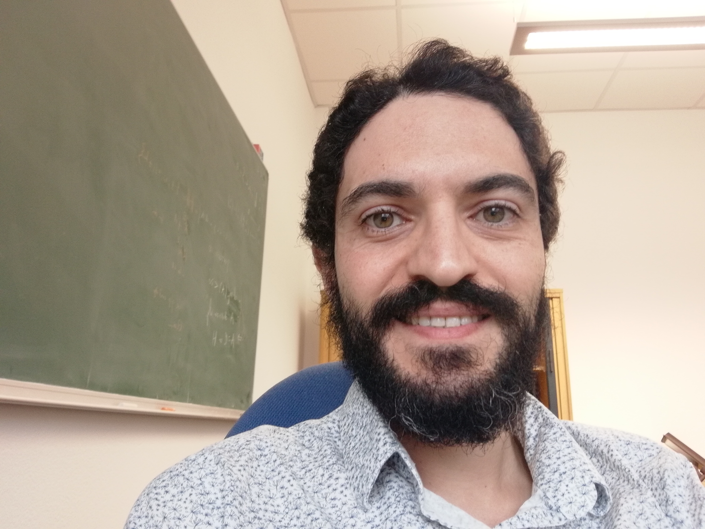

PhD Student in algebraic geometry - Teaching Assistant at Freie Universität Berlin. <a href="documents/cv-math-4.0.pdf" target="_blank">PDF.</a>

- Email: &emsp;&emsp;&emsp; marwan.benyoussef@gmail.com

- Phone: &emsp;&emsp;&emsp; +49 30 838 4 75374

- Office: &emsp;&emsp;&emsp; Arnimallee 3, Raum 011

- Address:&emsp;&emsp;&emsp;&emsp;Fachbereich Mathematik und Informatik, Institut für Mathematik, Freie Universität Berlin.
  
> Algebraic geometry is a mixture of the ideas of two Mediterranean cultures. It is the superposition of the Arab science of the lightening calculation of the solutions of equations over the Greek art of position and shape. This tapestry was originally woven on European soil and is still being refined under the influence of international fashion. Algebraic geometry studies the delicate balance between the geometrically plausible and the algebraically possible. Whenever one side of this mathematical teeter-totter outweighs the other, one immediately loses interest and runs off in search of a more exciting amusement.

-George R. Kempf (1944 – 2002) 

